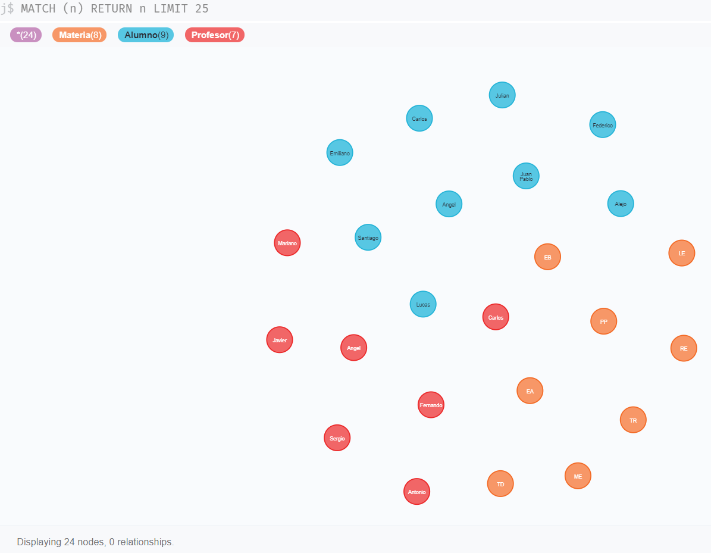
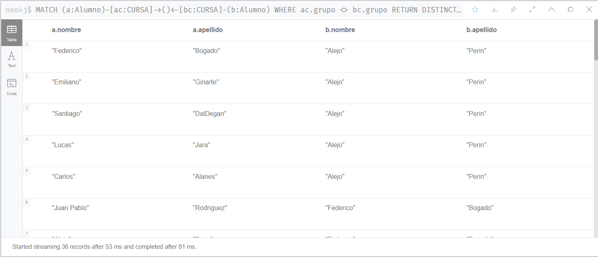
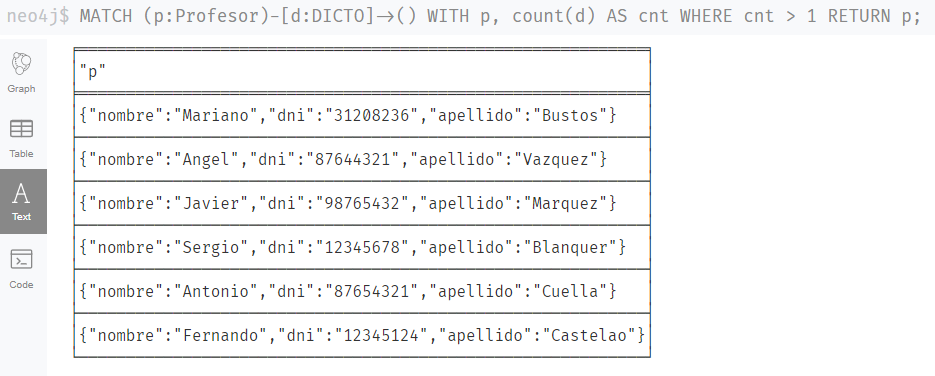
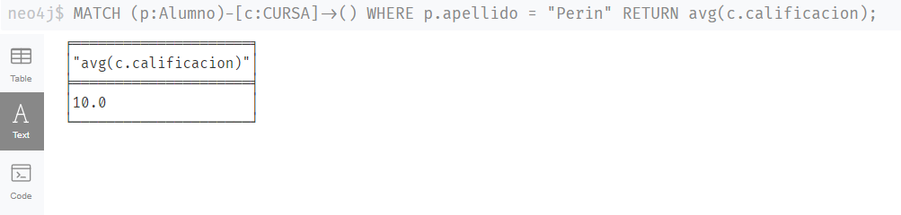
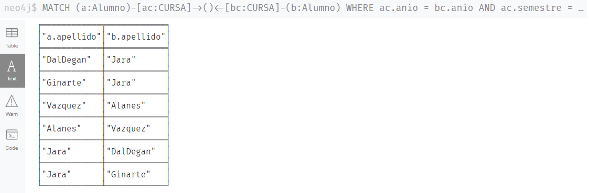
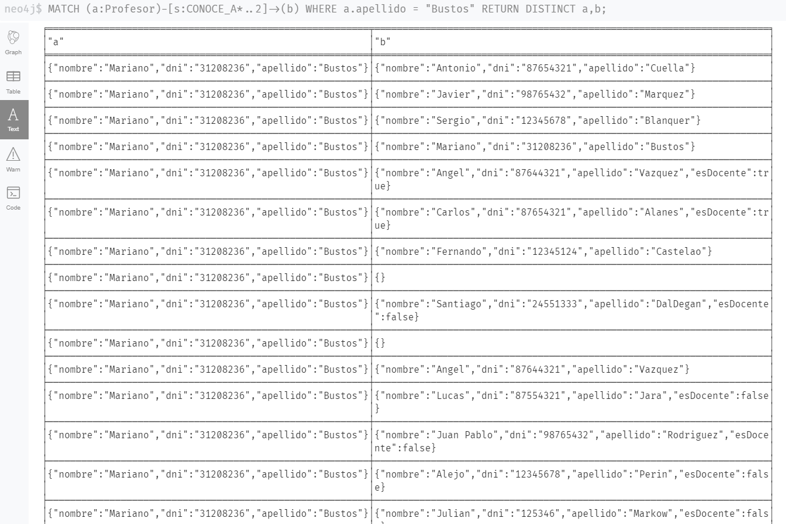
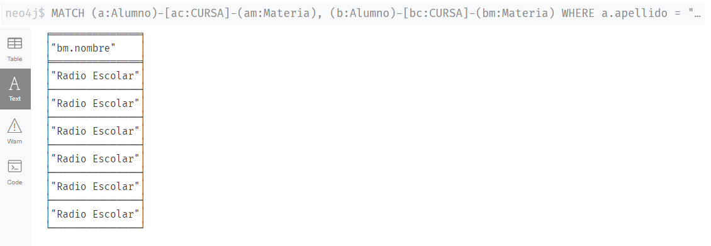
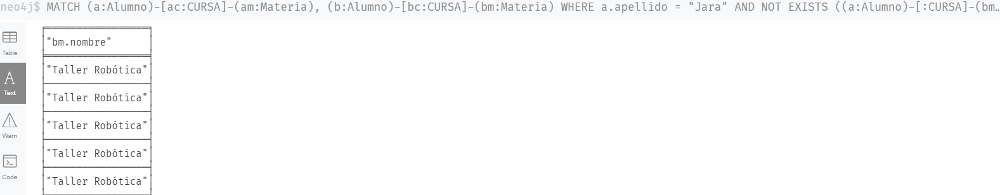
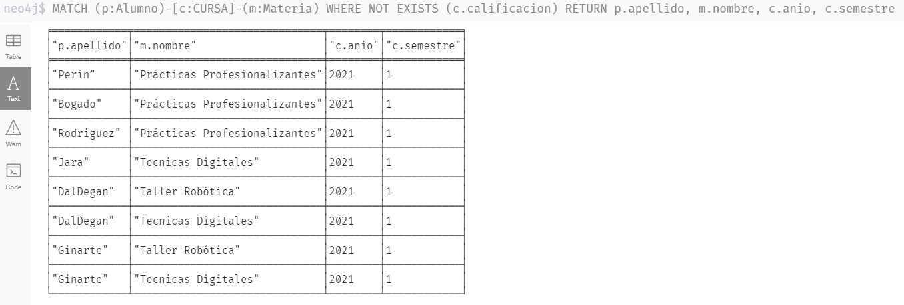

# Neo4j
Trabajo práctico para la materia grandes volúmenes de datos

# Introducción
En este repositorio se encuentra la solución a la guía de ejercicios sobre Neo4j propuesta por la cátedra.

# Prerequisitos
- Para correr el modelo se utilizó [Neo4j Sandbox](https://https://sandbox.neo4j.com/)


## Carga de nodos

En el archivo [datos.cypher](datos.cypher) se puede encontrar el código `cypher`
que se utilizó para la carga de los nodos y relaciones.

1. Ejecutar el siguiente fragmento de código

```cypher
// Comandos en Cypher para crear nodos y relaciones de materias y alumnos
// Para el motor neo4j 

// Creación de materias
CREATE ( TD: Materia { nombre: 'Tecnicas Digitales', codigo: 'TD', electiva: false });
CREATE ( EA: Materia { nombre: 'Electrónica Analogica', codigo: 'EA', electiva: false });
CREATE ( ME: Materia { nombre: 'Montajes Electrónicos', codigo: 'ME', electiva: false });
CREATE ( TR: Materia { nombre: 'Taller Robótica', codigo: 'TR', electiva: true });
CREATE ( PP: Materia { nombre: 'Prácticas Profesionalizantes', codigo: 'PP', electiva: false });
CREATE ( RE: Materia { nombre: 'Radio Escolar', codigo: 'RE', electiva: true });
CREATE ( LE: Materia { nombre: 'Lenguajes Electronicos', codigo: 'LE', electiva: false });
CREATE ( EB: Materia { nombre: 'Electrónica Basica', codigo: 'EB', electiva: false });

// Creación de alumnos
CREATE ( A1: Alumno { nombre: 'Alejo', apellido: 'Perin', dni: '12345678', esDocente: false });
CREATE ( A2: Alumno { nombre: 'Federico', apellido: 'Bogado', dni: '12345224', esDocente: false });
CREATE ( A3: Alumno { nombre: 'Juan Pablo', apellido: 'Rodriguez', dni: '98765432', esDocente: false });
CREATE ( A4: Alumno { nombre: 'Julian', apellido: 'Markow', dni: '125346', esDocente: false });
CREATE ( A5: Alumno { nombre: 'Lucas', apellido: 'Jara', dni: '87554321', esDocente: false });
CREATE ( A6: Alumno { nombre: 'Carlos', apellido: 'Alanes', dni: '87654321', esDocente: true });
CREATE ( A7: Alumno { nombre: 'Angel', apellido: 'Vazquez', dni: '87644321', esDocente: true });
CREATE ( A8: Alumno { nombre: 'Santiago', apellido: 'DalDegan', dni: '24551333', esDocente: false });
CREATE ( A9: Alumno { nombre: 'Emiliano', apellido: 'Ginarte', dni: '12345124', esDocente: false });


// Creación de profesores
CREATE ( P1: Profesor { nombre: 'Mariano', apellido: 'Bustos', dni: '31208236'});
CREATE ( P2: Profesor { nombre: 'Angel', apellido: 'Vazquez', dni: '87644321'});
CREATE ( P3: Profesor { nombre: 'Javier', apellido: 'Marquez', dni: '98765432'});
CREATE ( P4: Profesor { nombre: 'Sergio', apellido: 'Blanquer', dni: '12345678'});
CREATE ( P5: Profesor { nombre: 'Antonio', apellido: 'Cuella', dni: '87654321'});
CREATE ( P6: Profesor { nombre: 'Carlos', apellido: 'Alanes', dni: '87654321'});
CREATE ( P7: Profesor { nombre: 'Fernando', apellido: 'Castelao', dni: '12345124'});
```
2. Se puede visualizar los nodos creados utilizando
```cypher
MATCH (n) RETURN n
```


## Carga de relaciones
1. Para cargar las relaciones se utiliza el siguiente código:

```cypher
//Creación de relaciones DICTO (docentes)

MATCH (P2: Profesor { apellido:"Bustos"}), (TR: Materia { codigo: "TR"} ) CREATE (P2)-[:DICTO{anio: 2016, semestre: 1}]->(TR);
MATCH (P2: Profesor { apellido:"Bustos"}), (TR: Materia { codigo: "TR"} ) CREATE (P2)-[:DICTO{anio: 2017, semestre: 1}]->(TR);
MATCH (P3: Profesor { apellido:"Bustos"}), (PP: Materia { codigo: "PP"} ) CREATE (P3)-[:DICTO{anio: 2017, semestre: 1}]->(PP);
MATCH (P2: Profesor { apellido:"Bustos"}), (TR: Materia { codigo: "TR"} ) CREATE (P2)-[:DICTO{anio: 2018, semestre: 1}]->(TR);
MATCH (P3: Profesor { apellido:"Bustos"}), (PP: Materia { codigo: "PP"} ) CREATE (P3)-[:DICTO{anio: 2018, semestre: 1}]->(PP);
MATCH (P2: Profesor { apellido:"Bustos"}), (TR: Materia { codigo: "TR"} ) CREATE (P2)-[:DICTO{anio: 2019, semestre: 1}]->(TR);
MATCH (P3: Profesor { apellido:"Bustos"}), (PP: Materia { codigo: "PP"} ) CREATE (P3)-[:DICTO{anio: 2019, semestre: 1}]->(PP);
MATCH (P1: Profesor { apellido:"Bustos"}), (TD: Materia { codigo: "TD"} ) CREATE (P1)-[:DICTO{anio: 2020, semestre: 1}]->(TD);
MATCH (P2: Profesor { apellido:"Bustos"}), (TR: Materia { codigo: "TR"} ) CREATE (P2)-[:DICTO{anio: 2020, semestre: 1}]->(TR);
MATCH (P3: Profesor { apellido:"Bustos"}), (PP: Materia { codigo: "PP"} ) CREATE (P3)-[:DICTO{anio: 2020, semestre: 1}]->(PP);
MATCH (P1: Profesor { apellido:"Bustos"}), (TD: Materia { codigo: "TD"} ) CREATE (P1)-[:DICTO{anio: 2021, semestre: 1}]->(TD);
MATCH (P2: Profesor { apellido:"Bustos"}), (TR: Materia { codigo: "TR"} ) CREATE (P2)-[:DICTO{anio: 2021, semestre: 1}]->(TR);
MATCH (P3: Profesor { apellido:"Bustos"}), (PP: Materia { codigo: "PP"} ) CREATE (P3)-[:DICTO{anio: 2021, semestre: 1}]->(PP);
MATCH (P2: Profesor { apellido:"Vazquez"}), (LE: Materia { codigo: "LE"} ) CREATE (P2)-[:DICTO{anio: 2021, semestre: 1}]->(LE);
MATCH (P2: Profesor { apellido:"Vazquez"}), (PP: Materia { codigo: "PP"} ) CREATE (P2)-[:DICTO{anio: 2021, semestre: 1}]->(PP);
MATCH (P3: Profesor { apellido:"Marquez"}), (EA: Materia { codigo: "EA"} ) CREATE (P3)-[:DICTO{anio: 2018, semestre: 1}]->(EA);
MATCH (P3: Profesor { apellido:"Marquez"}), (EA: Materia { codigo: "EA"} ) CREATE (P3)-[:DICTO{anio: 2019, semestre: 1}]->(EA);
MATCH (P3: Profesor { apellido:"Marquez"}), (EA: Materia { codigo: "EA"} ) CREATE (P3)-[:DICTO{anio: 2020, semestre: 1}]->(EA);
MATCH (P3: Profesor { apellido:"Marquez"}), (EA: Materia { codigo: "EA"} ) CREATE (P3)-[:DICTO{anio: 2021, semestre: 1}]->(EA);
MATCH (P4: Profesor { apellido:"Blanquer"}), (ME: Materia { codigo: "ME"} ) CREATE (P4)-[:DICTO{anio: 2017, semestre: 1}]->(ME);
MATCH (P4: Profesor { apellido:"Blanquer"}), (ME: Materia { codigo: "ME"} ) CREATE (P4)-[:DICTO{anio: 2018, semestre: 1}]->(ME);
MATCH (P4: Profesor { apellido:"Blanquer"}), (ME: Materia { codigo: "ME"} ) CREATE (P4)-[:DICTO{anio: 2019, semestre: 1}]->(ME);
MATCH (P4: Profesor { apellido:"Blanquer"}), (ME: Materia { codigo: "ME"} ) CREATE (P4)-[:DICTO{anio: 2020, semestre: 1}]->(ME);
MATCH (P4: Profesor { apellido:"Blanquer"}), (ME: Materia { codigo: "ME"} ) CREATE (P4)-[:DICTO{anio: 2021, semestre: 1}]->(ME);


MATCH (P5: Profesor { apellido:"Cuella"}), (EB: Materia { codigo: "EB"} ) CREATE (P5)-[:DICTO{anio: 2014, semestre: 1}]->(EB);
MATCH (P5: Profesor { apellido:"Cuella"}), (EB: Materia { codigo: "EB"} ) CREATE (P5)-[:DICTO{anio: 2015, semestre: 1}]->(EB);
MATCH (P5: Profesor { apellido:"Cuella"}), (EB: Materia { codigo: "EB"} ) CREATE (P5)-[:DICTO{anio: 2016, semestre: 1}]->(EB);
MATCH (P5: Profesor { apellido:"Cuella"}), (EB: Materia { codigo: "EB"} ) CREATE (P5)-[:DICTO{anio: 2017, semestre: 1}]->(EB);
MATCH (P5: Profesor { apellido:"Cuella"}), (EB: Materia { codigo: "EB"} ) CREATE (P5)-[:DICTO{anio: 2018, semestre: 1}]->(EB);
MATCH (P5: Profesor { apellido:"Cuella"}), (EB: Materia { codigo: "EB"} ) CREATE (P5)-[:DICTO{anio: 2019, semestre: 1}]->(EB);
MATCH (P5: Profesor { apellido:"Cuella"}), (EB: Materia { codigo: "EB"} ) CREATE (P5)-[:DICTO{anio: 2020, semestre: 1}]->(EB);
MATCH (P5: Profesor { apellido:"Cuella"}), (EB: Materia { codigo: "EB"} ) CREATE (P5)-[:DICTO{anio: 2021, semestre: 1}]->(EB);
MATCH (P6: Profesor { apellido:"Alanes"}), (ME: Materia { codigo: "ME"} ) CREATE (P6)-[:DICTO{anio: 2021, semestre: 1}]->(ME);
MATCH (P7: Profesor { apellido:"Castelao"}), (RE: Materia { codigo: "RE"} ) CREATE (P7)-[:DICTO{anio: 2017, semestre: 1}]->(RE);
MATCH (P7: Profesor { apellido:"Castelao"}), (RE: Materia { codigo: "RE"} ) CREATE (P7)-[:DICTO{anio: 2018, semestre: 1}]->(RE);
MATCH (P7: Profesor { apellido:"Castelao"}), (RE: Materia { codigo: "RE"} ) CREATE (P7)-[:DICTO{anio: 2019, semestre: 1}]->(RE);
MATCH (P7: Profesor { apellido:"Castelao"}), (RE: Materia { codigo: "RE"} ) CREATE (P7)-[:DICTO{anio: 2020, semestre: 1}]->(RE);
MATCH (P7: Profesor { apellido:"Castelao"}), (RE: Materia { codigo: "RE"} ) CREATE (P7)-[:DICTO{anio: 2021, semestre: 1}]->(RE);

// Creacion de relaciones CURSA ( agrupadas por alumnos)

// PERIN
MATCH (A1: Alumno { apellido: "Perin"}), (EB: Materia { codigo: "EB"} ) 
CREATE (A1)-[:CURSA{anio: 2017, semestre: 1, cursando: false, grupo: 2,  calificacion: 10}]->(EB);
MATCH (A1: Alumno { apellido: "Perin"}), (TR: Materia { codigo: "TR"} ) 
CREATE (A1)-[:CURSA{anio: 2018, semestre: 1, cursando: false, grupo: 2,  calificacion: 10}]->(TR);
MATCH (A1: Alumno { apellido: "Perin"}), (EA: Materia { codigo: "EA"} ) 
CREATE (A1)-[:CURSA{anio: 2018, semestre: 1, cursando: false, grupo: 2,  calificacion: 10}]->(EA);
MATCH (A1: Alumno { apellido: "Perin"}), (ME: Materia { codigo: "ME"} ) 
CREATE (A1)-[:CURSA{anio: 2019, semestre: 1, cursando: false, grupo: 2,  calificacion: 10}]->(ME);
MATCH (A1: Alumno { apellido: "Perin"}), (TD: Materia { codigo: "TD"} ) 
CREATE (A1)-[:CURSA{anio: 2020, semestre: 1, cursando: false, grupo: 2,  calificacion: 10}]->(TD);
MATCH (A1: Alumno { apellido: "Perin"}), (PP: Materia { codigo: "PP"} ) 
CREATE (A1)-[:CURSA{anio: 2021, semestre: 1, cursando: true, grupo: 2,  calificacion: null}]->(PP);

// BOGADO
MATCH (A1: Alumno { apellido: "Bogado"}), (EB: Materia { codigo: "EB"} ) 
CREATE (A1)-[:CURSA{anio: 2017, semestre: 1, cursando: false, grupo: 1,  calificacion: 7}]->(EB);
MATCH (A1: Alumno { apellido: "Bogado"}), (EA: Materia { codigo: "EA"} ) 
CREATE (A1)-[:CURSA{anio: 2018, semestre: 1, cursando: false, grupo: 1,  calificacion: 7}]->(EA);
MATCH (A1: Alumno { apellido: "Bogado"}), (ME: Materia { codigo: "ME"} ) 
CREATE (A1)-[:CURSA{anio: 2019, semestre: 1, cursando: false, grupo: 1,  calificacion: 7}]->(ME);
MATCH (A1: Alumno { apellido: "Bogado"}), (TD: Materia { codigo: "TD"} ) 
CREATE (A1)-[:CURSA{anio: 2020, semestre: 1, cursando: false, grupo: 1,  calificacion: 7}]->(TD);
MATCH (A1: Alumno { apellido: "Bogado"}), (PP: Materia { codigo: "PP"} ) 
CREATE (A1)-[:CURSA{anio: 2021, semestre: 1, cursando: true, grupo: 1,  calificacion: null}]->(PP);

// Rodriguez
MATCH (A1: Alumno { apellido: "Rodriguez"}), (EB: Materia { codigo: "EB"} ) 
CREATE (A1)-[:CURSA{anio: 2017, semestre: 1, cursando: false, grupo: 2,  calificacion: 10}]->(EB);
MATCH (A1: Alumno { apellido: "Rodriguez"}), (TR: Materia { codigo: "TR"} ) 
CREATE (A1)-[:CURSA{anio: 2018, semestre: 1, cursando: false, grupo: 2,  calificacion: 10}]->(TR);
MATCH (A1: Alumno { apellido: "Rodriguez"}), (EA: Materia { codigo: "EA"} ) 
CREATE (A1)-[:CURSA{anio: 2018, semestre: 1, cursando: false, grupo: 2,  calificacion: 10}]->(EA);
MATCH (A1: Alumno { apellido: "Rodriguez"}), (ME: Materia { codigo: "ME"} ) 
CREATE (A1)-[:CURSA{anio: 2019, semestre: 1, cursando: false, grupo: 2,  calificacion: 10}]->(ME);
MATCH (A1: Alumno { apellido: "Rodriguez"}), (TD: Materia { codigo: "TD"} ) 
CREATE (A1)-[:CURSA{anio: 2020, semestre: 1, cursando: false, grupo: 2,  calificacion: 10}]->(TD);
MATCH (A1: Alumno { apellido: "Rodriguez"}), (PP: Materia { codigo: "PP"} ) 
CREATE (A1)-[:CURSA{anio: 2021, semestre: 1, cursando: true, grupo: 2,  calificacion: null}]->(PP);

// MARKOW
MATCH (A1: Alumno { apellido: "Markow"}), (EB: Materia { codigo: "EB"} ) 
CREATE (A1)-[:CURSA{anio: 2019, semestre: 1, cursando: false, grupo: 2,  calificacion: 10}]->(EB);
MATCH (A1: Alumno { apellido: "Markow"}), (TR: Materia { codigo: "TR"} ) 
CREATE (A1)-[:CURSA{anio: 2019, semestre: 1, cursando: false, grupo: 2,  calificacion: 10}]->(TR);
MATCH (A1: Alumno { apellido: "Markow"}), (EA: Materia { codigo: "EA"} ) 
CREATE (A1)-[:CURSA{anio: 2020, semestre: 1, cursando: false, grupo: 2,  calificacion: 10}]->(EA);

// JARA
MATCH (A1: Alumno { apellido: "Jara"}), (EB: Materia { codigo: "EB"} ) 
CREATE (A1)-[:CURSA{anio: 2018, semestre: 1, cursando: false, grupo: 1,  calificacion: 7}]->(EB);
MATCH (A1: Alumno { apellido: "Jara"}), (EA: Materia { codigo: "EA"} ) 
CREATE (A1)-[:CURSA{anio: 2019, semestre: 1, cursando: false, grupo: 1,  calificacion: 4}]->(EA);
MATCH (A1: Alumno { apellido: "Jara"}), (ME: Materia { codigo: "ME"} ) 
CREATE (A1)-[:CURSA{anio: 2020, semestre: 1, cursando: false, grupo: 1,  calificacion: 7}]->(ME);
MATCH (A1: Alumno { apellido: "Jara"}), (RE: Materia { codigo: "RE"} ) 
CREATE (A1)-[:CURSA{anio: 2020, semestre: 1, cursando: false, grupo: 1,  calificacion: 7}]->(RE);
MATCH (A1: Alumno { apellido: "Jara"}), (TD: Materia { codigo: "TD"} ) 
CREATE (A1)-[:CURSA{anio: 2021, semestre: 1, cursando: true, grupo: 1,  calificacion: null}]->(TD);

// ALANES
MATCH (A1: Alumno { apellido: "Alanes"}), (TR: Materia { codigo: "TR"} ) 
CREATE (A1)-[:CURSA{anio: 2016, semestre: 1, cursando: false, grupo: 1,  calificacion: 10}]->(TR);

// VAZQUEZ
MATCH (A1: Alumno { apellido: "Vazquez"}), (TR: Materia { codigo: "TR"} ) 
CREATE (A1)-[:CURSA{anio: 2016, semestre: 1, cursando: false, grupo: 2,  calificacion: 10}]->(TR);
MATCH (A1: Alumno { apellido: "Vazquez"}), (TR: Materia { codigo: "TR"} ) 
CREATE (A1)-[:CURSA{anio: 2017, semestre: 1, cursando: false, grupo: 2,  calificacion: 10}]->(TR);

// DALDEGAN
MATCH (A1: Alumno { apellido: "DalDegan"}), (EB: Materia { codigo: "EB"} ) 
CREATE (A1)-[:CURSA{anio: 2018, semestre: 1, cursando: false, grupo: 1,  calificacion: 10}]->(EB);
MATCH (A1: Alumno { apellido: "DalDegan"}), (EA: Materia { codigo: "EA"} ) 
CREATE (A1)-[:CURSA{anio: 2019, semestre: 1, cursando: false, grupo: 1,  calificacion: 10}]->(EA);
MATCH (A1: Alumno { apellido: "DalDegan"}), (ME: Materia { codigo: "ME"} ) 
CREATE (A1)-[:CURSA{anio: 2020, semestre: 1, cursando: false, grupo: 1,  calificacion: 10}]->(ME);
MATCH (A1: Alumno { apellido: "DalDegan"}), (TD: Materia { codigo: "TD"} ) 
CREATE (A1)-[:CURSA{anio: 2021, semestre: 1, cursando: true, grupo: 1,  calificacion: null}]->(TD);
MATCH (A1: Alumno { apellido: "DalDegan"}), (TR: Materia { codigo: "TR"} ) 
CREATE (A1)-[:CURSA{anio: 2021, semestre: 1, cursando: true, grupo: 1,  calificacion: null}]->(TR);

// GINARTE
MATCH (A1: Alumno { apellido: "Ginarte"}), (EB: Materia { codigo: "EB"} ) 
CREATE (A1)-[:CURSA{anio: 2018, semestre: 1, cursando: false, grupo: 1,  calificacion: 7}]->(EB);
MATCH (A1: Alumno { apellido: "Ginarte"}), (EA: Materia { codigo: "EA"} ) 
CREATE (A1)-[:CURSA{anio: 2019, semestre: 1, cursando: false, grupo: 1,  calificacion: 7}]->(EA);
MATCH (A1: Alumno { apellido: "Ginarte"}), (ME: Materia { codigo: "ME"} ) 
CREATE (A1)-[:CURSA{anio: 2020, semestre: 1, cursando: false, grupo: 1,  calificacion: 7}]->(ME);
MATCH (A1: Alumno { apellido: "Ginarte"}), (TD: Materia { codigo: "TD"} ) 
CREATE (A1)-[:CURSA{anio: 2021, semestre: 1, cursando: true, grupo: 1,  calificacion: null}]->(TD);
MATCH (A1: Alumno { apellido: "Ginarte"}), (TR: Materia { codigo: "TR"} ) 
CREATE (A1)-[:CURSA{anio: 2021, semestre: 1, cursando: true, grupo: 1,  calificacion: null}]->(TR);


//Creación de relaciones CONOCE (ordenados por persona)
//Perin
MATCH(A1: Alumno { apellido: "Perin"}), (A2: Alumno { apellido: "Bogado"}) CREATE (A1)-[:CONOCE_A]->(A2);
MATCH(A1: Alumno { apellido: "Perin"}), (A2: Alumno { apellido: "Rodriguez"}) CREATE (A1)-[:CONOCE_A]->(A2);
MATCH(A1: Alumno { apellido: "Perin"}), (P1: Profesor { apellido: "Bustos"}) CREATE (A1)-[:CONOCE_A]->(P1);

// Bogado
MATCH(A1: Alumno { apellido: "Bogado"}), (A2: Alumno { apellido: "Perin"}) CREATE (A1)-[:CONOCE_A]->(A2);
MATCH(A1: Alumno { apellido: "Bogado"}), (A2: Alumno { apellido: "Rodriguez"}) CREATE (A1)-[:CONOCE_A]->(A2);
MATCH(A1: Alumno { apellido: "Bogado"}), (P1: Profesor { apellido: "Bustos"}) CREATE (A1)-[:CONOCE_A]->(P1);

// Rodriguez
MATCH(A1: Alumno { apellido: "Rodriguez"}), (A2: Alumno { apellido: "Perin"}) CREATE (A1)-[:CONOCE_A]->(A2);
MATCH(A1: Alumno { apellido: "Rodriguez"}), (A2: Alumno { apellido: "Bogado"}) CREATE (A1)-[:CONOCE_A]->(A2);
MATCH(A1: Alumno { apellido: "Rodriguez"}),(P1: Profesor { apellido: "Bustos"}) CREATE (A1)-[:CONOCE_A]->(P1);

// Markow
MATCH(A1: Alumno { apellido: "Markow"}), (A2: Alumno { apellido: "Perin"}) CREATE (A1)-[:CONOCE_A]->(A2);
MATCH(A1: Alumno { apellido: "Markow"}), (A2: Alumno { apellido: "Rodriguez"}) CREATE (A1)-[:CONOCE_A]->(A2);
MATCH(A1: Alumno { apellido: "Markow"}), (P1: Profesor { apellido: "Bustos"}) CREATE (A1)-[:CONOCE_A]->(P1);

// Jara
MATCH(A1: Alumno { apellido: "Jara"}), (P1: Profesor { apellido: "Marquez"}) CREATE (A1)-[:CONOCE_A]->(P1);
MATCH(A1: Alumno { apellido: "Jara"}), (P2: Profesor { apellido: "Bustos"}) CREATE (A1)-[:CONOCE_A]->(P2);

// Alanes
MATCH(A1: Alumno { apellido: "Alanes"}), (P1: Profesor { apellido: "Marquez"}) CREATE (A1)-[:CONOCE_A]->(P1);
MATCH(A1: Alumno { apellido: "Alanes"}), (P2: Profesor { apellido: "Bustos"}) CREATE (A1)-[:CONOCE_A]->(P2);
MATCH(A1: Alumno { apellido: "Alanes"}), (P3: Profesor { apellido: "Vazquez"}) CREATE (A1)-[:CONOCE_A]->(P3);

// Vazquez
MATCH(A1: Alumno { apellido: "Vazquez"}), (P1: Profesor { apellido: "Marquez"}) CREATE (A1)-[:CONOCE_A]->(P1);
MATCH(A1: Alumno { apellido: "Vazquez"}), (P2: Profesor { apellido: "Bustos"}) CREATE (A1)-[:CONOCE_A]->(P2);
MATCH(A1: Alumno { apellido: "Vazquez"}), (P3: Profesor { apellido: "Blanquer"}) CREATE (A1)-[:CONOCE_A]->(P3);


// DalDegan
MATCH(A1: Alumno { apellido: "DalDegan"}), (A2: Alumno { apellido: "Ginarte"}) CREATE (A1)-[:CONOCE_A]->(A2);
MATCH(A1: Alumno { apellido: "DalDegan"}), (P1: Profesor { apellido: "Bustos"}) CREATE (A1)-[:CONOCE_A]->(P1);
MATCH(A1: Alumno { apellido: "DalDegan"}), (P2: Profesor { apellido: "Vazquez"}) CREATE (A1)-[:CONOCE_A]->(P2);
MATCH(A1: Alumno { apellido: "DalDegan"}), (P3: Profesor { apellido: "Marquez"}) CREATE (A1)-[:CONOCE_A]->(P3);
MATCH(A1: Alumno { apellido: "DalDegan"}), (P4: Profesor { apellido: "Castelao"}) CREATE (A1)-[:CONOCE_A]->(P4);

// Ginarte
MATCH(A1: Alumno { apellido: "Ginarte"}), (A2: Alumno { apellido: "DalDegan"}) CREATE (A1)-[:CONOCE_A]->(A2);
MATCH(A1: Alumno { apellido: "Ginarte"}), (P1: Profesor { apellido: "Bustos"}) CREATE (A1)-[:CONOCE_A]->(P1);
MATCH(A1: Alumno { apellido: "Ginarte"}), (P2: Profesor { apellido: "Vazquez"}) CREATE (A1)-[:CONOCE_A]->(P2);
MATCH(A1: Alumno { apellido: "Ginarte"}), (P3: Profesor { apellido: "Marquez"}) CREATE (A1)-[:CONOCE_A]->(P3);
MATCH(A1: Alumno { apellido: "Ginarte"}), (P4: Profesor { apellido: "Castelao"}) CREATE (A1)-[:CONOCE_A]->(P4);

// Bustos
MATCH(P1: Profesor { apellido: "Bustos"}), (A1: Alumno { apellido: "Perin"}) CREATE (A1)-[:CONOCE_A]->(A1);
MATCH(P1: Profesor { apellido: "Bustos"}), (A2: Alumno { apellido: "DalDegan"}) CREATE (P1)-[:CONOCE_A]->(A2);
MATCH(P1: Profesor { apellido: "Bustos"}), (A3: Alumno { apellido: "Ginarte"}) CREATE (P1)-[:CONOCE_A]->(A3);
MATCH(P1: Profesor { apellido: "Bustos"}), (A4: Alumno { apellido: "Rodriguez"}) CREATE (P1)-[:CONOCE_A]->(A4);
MATCH(P1: Profesor { apellido: "Bustos"}), (A5: Alumno { apellido: "Markow"}) CREATE (P1)-[:CONOCE_A]->(A5);
MATCH(P1: Profesor { apellido: "Bustos"}), (A6: Alumno { apellido: "Jara"}) CREATE (P1)-[:CONOCE_A]->(A6);
MATCH(P1: Profesor { apellido: "Bustos"}), (A7: Alumno { apellido: "Alanes"}) CREATE (P1)-[:CONOCE_A]->(A7);
MATCH(P1: Profesor { apellido: "Bustos"}), (A8: Alumno { apellido: "Vazquez"}) CREATE (P1)-[:CONOCE_A]->(A8);
MATCH(P1: Profesor { apellido: "Bustos"}), (P2: Profesor { apellido: "Cuella"}) CREATE (P1)-[:CONOCE_A]->(P2);
MATCH(P1: Profesor { apellido: "Bustos"}), (P3: Profesor { apellido: "Blanquer"}) CREATE (P1)-[:CONOCE_A]->(P3);
MATCH(P1: Profesor { apellido: "Bustos"}), (P4: Profesor { apellido: "Marquez"}) CREATE (P1)-[:CONOCE_A]->(P4);
MATCH(P1: Profesor { apellido: "Bustos"}), (P5: Profesor { apellido: "Castelao"}) CREATE (P1)-[:CONOCE_A]->(P5);

// Marquez
MATCH(P1: Profesor { apellido: "Marquez"}), (A1: Alumno { apellido: "Perin"}) CREATE (A1)-[:CONOCE_A]->(A1);
MATCH(P1: Profesor { apellido: "Marquez"}), (A2: Alumno { apellido: "DalDegan"}) CREATE (P1)-[:CONOCE_A]->(A2);
MATCH(P1: Profesor { apellido: "Marquez"}), (P2: Profesor { apellido: "Bustos"}) CREATE (P1)-[:CONOCE_A]->(P2);
MATCH(P1: Profesor { apellido: "Marquez"}), (P3: Profesor { apellido: "Blanquer"}) CREATE (P1)-[:CONOCE_A]->(P3);
MATCH(P1: Profesor { apellido: "Marquez"}), (P4: Profesor { apellido: "Cuella"}) CREATE (P1)-[:CONOCE_A]->(P3);
MATCH(P1: Profesor { apellido: "Marquez"}), (P5: Profesor { apellido: "Castelao"}) CREATE (P1)-[:CONOCE_A]->(P5);

// Blanquer
MATCH(P1: Profesor { apellido: "Blanquer"}), (A1: Alumno { apellido: "Perin"}) CREATE (A1)-[:CONOCE_A]->(A1);
MATCH(P1: Profesor { apellido: "Blanquer"}), (A2: Alumno { apellido: "DalDegan"}) CREATE (P1)-[:CONOCE_A]->(A2);
MATCH(P1: Profesor { apellido: "Blanquer"}), (P2: Profesor { apellido: "Bustos"}) CREATE (P1)-[:CONOCE_A]->(P2);
MATCH(P1: Profesor { apellido: "Blanquer"}), (P3: Profesor { apellido: "Blanquer"}) CREATE (P1)-[:CONOCE_A]->(P3);
MATCH(P1: Profesor { apellido: "Blanquer"}), (P4: Profesor { apellido: "Cuella"}) CREATE (P1)-[:CONOCE_A]->(P3);
MATCH(P1: Profesor { apellido: "Blanquer"}), (P5: Profesor { apellido: "Castelao"}) CREATE (P1)-[:CONOCE_A]->(P5);

// Cuella
MATCH(P1: Profesor { apellido: "Cuella"}), (A1: Alumno { apellido: "Jara"}) CREATE (A1)-[:CONOCE_A]->(A1);
MATCH(P1: Profesor { apellido: "Cuella"}), (A2: Alumno { apellido: "Alanes"}) CREATE (P1)-[:CONOCE_A]->(A2);
MATCH(P1: Profesor { apellido: "Cuella"}), (A3: Alumno { apellido: "Vazquez"}) CREATE (P1)-[:CONOCE_A]->(A3);
MATCH(P1: Profesor { apellido: "Cuella"}), (P2: Profesor { apellido: "Bustos"}) CREATE (P1)-[:CONOCE_A]->(P2);
MATCH(P1: Profesor { apellido: "Cuella"}), (P3: Profesor { apellido: "Blanquer"}) CREATE (P1)-[:CONOCE_A]->(P3);
MATCH(P1: Profesor { apellido: "Cuella"}), (P4: Profesor { apellido: "Marquez"}) CREATE (P1)-[:CONOCE_A]->(P4);
MATCH(P1: Profesor { apellido: "Cuella"}), (P5: Profesor { apellido: "Castelao"}) CREATE (P1)-[:CONOCE_A]->(P5);

// Castelao
MATCH(P1: Profesor { apellido: "Castelao"}), (A1: Alumno { apellido: "Jara"}) CREATE (A1)-[:CONOCE_A]->(A1);
MATCH(P1: Profesor { apellido: "Castelao"}), (A2: Alumno { apellido: "Alanes"}) CREATE (P1)-[:CONOCE_A]->(A2);
MATCH(P1: Profesor { apellido: "Castelao"}), (A3: Alumno { apellido: "Vazquez"}) CREATE (P1)-[:CONOCE_A]->(A3);
MATCH(P1: Profesor { apellido: "Castelao"}), (P2: Profesor { apellido: "Bustos"}) CREATE (P1)-[:CONOCE_A]->(P2);
MATCH(P1: Profesor { apellido: "Castelao"}), (P3: Profesor { apellido: "Blanquer"}) CREATE (P1)-[:CONOCE_A]->(P3);
MATCH(P1: Profesor { apellido: "Castelao"}), (P4: Profesor { apellido: "Marquez"}) CREATE (P1)-[:CONOCE_A]->(P4);
MATCH(P1: Profesor { apellido: "Castelao"}), (P5: Profesor { apellido: "Cuella"}) CREATE (P1)-[:CONOCE_A]->(P5);

```


# Consultas requeridas

## 1. Listado de alumnos que cursaron la misma materia, pero en esta materia son de distintos grupos
```cypher
MATCH (a:Alumno)-[ac:CURSA]->()<-[bc:CURSA]-(b:Alumno)
WHERE ac.grupo <> bc.grupo
RETURN DISTINCT a.nombre, a.apellido, b.nombre, b.apellido;
```
Resultado:


## 2. Listado de personas que dictaron más de una materia
```cypher
MATCH (p:Profesor)-[d:DICTO]->()
WITH p, count(d) AS cnt
WHERE cnt > 1
RETURN p;
```
Resultado:


## 3. Calculo de mi promedio (Asumo que soy alumno Perin)
```cypher
MATCH (p:Alumno)-[c:CURSA]->()
WHERE p.apellido = "Perin"
RETURN avg(c.calificacion);
```
Resultado:


## 4. Recomendación de personas que cursaron juntas pero no se conocen
```cypher
MATCH (a:Alumno)-[ac:CURSA]->()<-[bc:CURSA]-(b:Alumno)
WHERE ac.anio = bc.anio 
AND ac.semestre = bc.semestre
AND NOT (a)-[:CONOCE_A]-(b)
RETURN DISTINCT a.apellido, b.apellido;
```
Resultado:


## 5.1. Conocidos de mis conocidos hasta longitud 2
```cypher
MATCH (a:Profesor)-[s:CONOCE_A*..2]->(b)
WHERE a.apellido = "Bustos"
RETURN DISTINCT a,b;
```
Resultado:


## 6. Alumnos que también son docentes (dictaron y cursaron materias)
```cypher
MATCH (p:Profesor)-[d:DICTO]->()
WITH p, count(d) AS cntd
WHERE cntd > 0
MATCH (p)-[c:CURSA]->()
WITH p, count(c) AS cntc
WHERE cntc > 0
RETURN p;
```

## 7. Dado un alumno en particular, se quiere obtener el listado de materias electivas que no haya cursado, en base al criterio de haber sido cursadas por otros alumnos que cursaron por lo menos una en común con él:
```cypher
MATCH (a:Alumno)-[ac:CURSA]-(am:Materia), (b:Alumno)-[bc:CURSA]-(bm:Materia)
WHERE a.apellido = "Perin"
AND NOT EXISTS ((a:Alumno)-[:CURSA]-(bm:Materia))
AND ac.semestre = bc.semestre
AND bm.electiva = true
RETURN bm.nombre;
```
Resultado:


## 8. Materias optativas que no he cursado y que curso alguien con quien yo he cursado y es conocido directo o indirecto
```cypher
MATCH (a:Alumno)-[ac:CURSA]-(am:Materia), (b:Alumno)-[bc:CURSA]-(bm:Materia)
WHERE a.apellido = "JARA"
AND NOT EXISTS ((a:Alumno)-[:CURSA]-(bm:Materia))
AND ac.semestre = bc.semestre
AND bm.electiva = true
AND EXISTS ((a:Alumno)-[:CONOCE_A*..]-(b:Alumno))
RETURN DISTINCT bm.nombre;
```
Resultado:


## 9. Lista de alumnos que les falta alguna calificación
A continuación se presenta una consulta capaz de detectar si hay alumnos que no han sido calificados
en alguna materia
```cypher
MATCH (p:Alumno)-[c:CURSA]-(m:Materia) 
WHERE NOT EXISTS (c.calificacion)
RETURN p.apellido, m.nombre, c.anio, c.semestre
```
Resultado:

